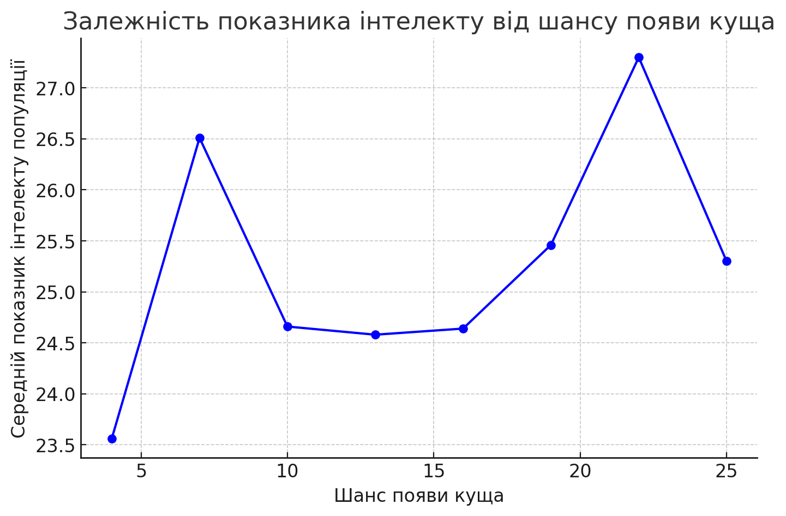
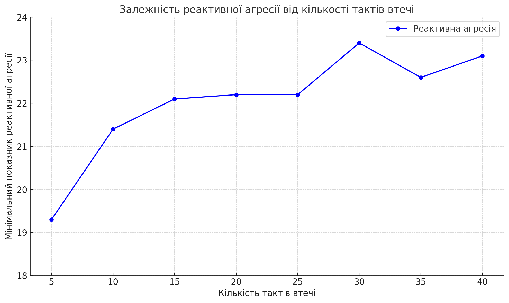
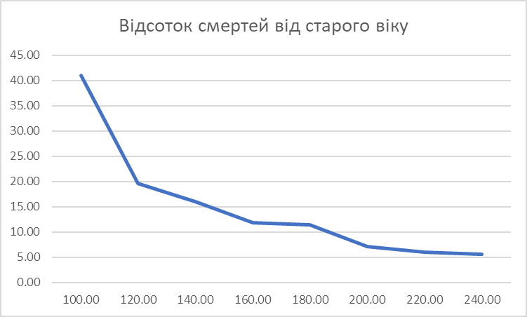

## Комп'ютерні системи імітаційного моделювання
## СПм-23-4, **Коротецький Олександр Олексійович**
### Лабораторна робота №**1**. Опис імітаційних моделей та проведення обчислювальних експериментів

 

### Варіант 13, модель у середовищі NetLogo:
[Fruit Wars](http://www.netlogoweb.org/launch#http://www.netlogoweb.org/assets/modelslib/Sample%20Models/Social%20Science/Economics/Fruit%20Wars.nlogo)
 

### Вербальний опис моделі:
Розгляд боротьби за обмежені ресурси у різних групах людської популяції. Кожна людина моделюється агентом, який дотримається ряду спрощених правил: він рухається вперед (йде) та повертається в сторони, йде до поживного куща якщо він в радіусі, коли доходить до куща він або збирає їжу з куща (після чого кущ зникає) та (якщо в малому радіусі куща є дві або більше людини) 1 - кооперується в зборі їжі з іншими людьми що прискорює збір їжі і дає енергію всім учасникам збору, 2 - бореться з іншими людьми за їжу (проактивно та реактивно), 3 - втікає від нападаючої людини. Кущі з'являються з певним темпом появи на полі. Після набору певного значення енергії людина розмножується, "дитина" піддається мутаціям геному через що її характеристики і поведінка змінюються. Людина може померти якщо вона: не може знайти їжу достатньо довгий час; живе занадто довгий час; переможена іншою людою.
Модель показує різноманітні стратегії поведінки розрізнених людей за обмежені (хоч і у більшості випадків з часом поновлювані) ресурси та їх переваги та недоліки.

### Керуючі параметри:
- **initial-fruit-bushes** визначає початкову кількість поживних кущів у середовищі моделювання, тобто, в даній моделі, початкову кількість поживних кущів на замкненому полі.
- **initial-foragers** визначає кількість первісних агентів у середовищі моделювання, тобто, в даній моделі, початкову кількість людей на замкненому полі.
- **ticks-to-flee** визначає час за який людина буде втікати від напавшої на неї людини і за який не буде звертати увагу на збір їжі з кущів.
- **rate-of-mutation** визначає шанс появи мутації у одному з генів.
- **collaboration-bonus** визначає бонус швидкості колабораційного (від двох людей у радіусі) збору їжі з поживних кущів.
- **max-age** визначає максимальну тривалість життя людини.
- **bush-growth-chance** визначає шанс появи куща за одиницю часу.

### Внутрішні параметри:
- **energy** метаболічна енергія людини.
- **genome** список генів людини що визначають інтелект, силу та швидкість. Наслідуються "дитиною".
- **foraging?** статус людини чи вона зараз зайнята збором їжі з поживного куща.
- **fleeing?** статус людини чи вона зараз зайнята втечою від нападу іншої людини.
- **fleeing-turns** залишок часу, за спливом якого людина перестане втікати від нападу іншої людини. Це загальний параметр для всіх агентів.
- **age** вік агенту що рахується у проміжках часу.
- **speed** швидкість агенту (переміщення людини пішки). Визначається геномом.
- **strength** сила агенту, визначає успіх боротьби (Борітеся - поборете!). Визначається геномом.
- **intelligence** розум агенту, додатково визначає швидкість колабораційного збору їжі. Визначається геномом.
- **reactive-aggression** визначає шанс спроби нападу на іншу людину (при близості до поживного кущу і наявності там іншої людини). Визначається геномом.
- **proactive-aggression** визначає шанс спроби самозахисту (втечею або боротьбою). Визначається геномом.

### Показники роботи моделі:
- поточна чисельність популяції людей.
- середня чисельність популяції людей за увесь час.
- темп збору їжі, тобто, сумарний показник швидкості збору їжі популяцією.
- кількість смертей розділених за причинами смерті, тобто, графік загальної кількостей смертей за типом (голод, вік, вбивство) від часу.
- кількість випадків боротьби, тобто графік кількості загальних випадків боротьби за типом (реактивний, проактивний) від часу.
- поточна кількість випадків боротьби за короткий проміжок часу за типом
- середнє значення рис популяції, тобто, графік середнього значення характеристик за типом (сила, швидкість, інтелект) наявні в популяції від часу.

### Примітки:
При налаштуваннях керуючих параметрів за замовчуванням, регулюється швидкість зміни характеристик та поведінки у більш та менш колабораційну/агресивну, регулюється потенційно можлива чисельність популяції, шанс виживання популяції через деякий час.

### Недоліки моделі:
Люди у цій моделі завжди вважаються розрізненими, навіть "діти" не вважають своїх "батьків" союзниками за замовчуванням. Люди значну частину часу рухаються хаотично при відсутності поживних кущів у деякому радіусі виявлення і не мають визначеної стратегії пошуку їжі. Люди не мають можливістю ділитися їжею з людьми в яких мало енегрії. Поживні кущі не розрізняються за початковою кількістю надаваємої енергії. Колабораційно люди з одного куща збирають значно більше їжі ніж поодинці, при тому що кущ зникає після початку збору з нього їжі через статичний час. Немає поняття сезонів що будуть впливати на характеристики людей, на шанс їх агресії/колаборації, на темп росту поживних кущів і їх поживність.

 

## Обчислювальні експерименти
### 1. Вплив доступності їжі на середній рівень інтелекту популяції
Досліджується залежність середнього показнику рівня інтелекту протягом певної кількості тактів (2000) від швидкості появи поживних кущів, зазначеного на початку симуляції.
Експерименти проводяться при початковій популяції в 40 людей з відсотком можливості мутації підвищеним до значення 10 для прискорення зміни поведінки, усього 8 симуляцій з кроком 3.
Інші керуючі параметри мають значення за замовчуванням:
- **initial-foragers**: 40
- **initial-fruit-bushes**: 40
- **ticks-to-flee**: 49
- **rate-of-mutation**: 10
- **collaboration-bonus**: 5
- **max-age**: 500

<table>
<thead>
<tr><th>Шанс появи куща</th><th>Середній показник інтелекту популяції</th></tr>
</thead>
<tbody>
<tr><td>25</td><td>25,3</td></tr>
<tr><td>22</td><td>27,3</td></tr>
<tr><td>19</td><td>25,46</td></tr>
<tr><td>16</td><td>24,64</td></tr>
<tr><td>13</td><td>24,58</td></tr>
<tr><td>10</td><td>24,66</td></tr>
<tr><td>7</td><td>26,51</td></tr>
<tr><td>4</td><td>23,56</td></tr>
</tbody>
</table>

Графік наочно показує, що високий інтелект не підвищується зі зменшенням шансу знайти їжу, так як геном людей змінюється достатньо швидко з шансом мутації 10, при такому високому шансі мутації комбінація генома волатильна і не здатна підтримувати одну й ту саму модель поведінки на протязі навіть найближчих поколінь.

### 2. Вплив кількості тактів втечі на реактивну аргесивність популяції
Досліджується залежність схильності популяції що приймуть напасти при зборі їжі, моделювання обмежене по часу в 4000 тактах. Експерименти проводяться при початковій популяції в 40 людей з відсотком можливості мутації встановленим в 3.5, усього 8 симуляцій з кроком 5.
- **initial-foragers**: 40
- **initial-fruit-bushes**: 40
- **bush-growth-chance** 11
- **ticks-to-flee**: 5
- **rate-of-mutation**: 3.5
- **collaboration-bonus**: 5
- **max-age**: 500

<table>
<thead>
<tr><th>Кількість тактів втечі</th><th>Мінімальний показник реактивної агресії популяції</th></tr>
</thead>
<tbody>
<tr><td>5</td><td>19,3</td></tr>
<tr><td>10</td><td>21,4</td></tr>
<tr><td>15</td><td>22,1</td></tr>
<tr><td>20</td><td>22,2</td></tr>
<tr><td>25</td><td>22,2</td></tr>
<tr><td>30</td><td>23,4</td></tr>
<tr><td>35</td><td>22,6</td></tr>
<tr><td>40</td><td>23,10</td></tr>
</tbody>
</table>

Графік показує вплив кількості тактів втечі на реактивну аргесивність популяції за принципом що чим менше людина втікає від загрози, тим скоріше вона почне шукати новий кущ з їжою і тут є чинники: 1. людина витрачає енергію на втечу і може загинути за її нестачі; 2. людина не розмножується так часто так як в неї все більша частина енергії відводиться на втечу, що еволюційно є невдалою поведінкою в цій моделі.

### 3. Вплив максимального віку при нестачі їжі на кількість смертей від старого віку
Досліджується чинник смерті популяції від старого віку при обмежених ресурсах таких як час та енергія, моделювання обмежене по часу в 1500 тактах. Усього 8 симуляцій з кроком 20.
- **initial-foragers**: 40
- **initial-fruit-bushes**: 40
- **bush-growth-chance** 6
- **ticks-to-flee**: 10
- **rate-of-mutation**: 2
- **collaboration-bonus**: 5
- **max-age**: 100

<table>
<thead>
<tr><th>Максимальна довжина життя в тактах</th><th>Відсоток смертей від старого віку</th></tr>
</thead>
<tbody>
<tr><td>100</td><td>40,94</td></tr>
<tr><td>120</td><td>19,56</td></tr>
<tr><td>140</td><td>16,0</td></tr>
<tr><td>160</td><td>11,79</td></tr>
<tr><td>180</td><td>11,42</td></tr>
<tr><td>200</td><td>7,17</td></tr>
<tr><td>220</td><td>6,07</td></tr>
<tr><td>240</td><td>5,62</td></tr>
</tbody>
</table>

Графік наглядно показує що в умовах коли людина має пройти занадто далеку відстань до їжі, вона дуже часто помирає від старого віку, навіть при наявності енергії. Зі збільшенням показника максимального віку навіть на другому кроці видно значну зміну тенденції смертей від старого віку, так як цього часу починає вистачати все більше на проходження шляху до їжі.