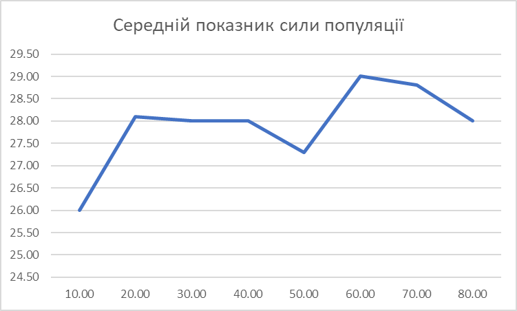

## Комп'ютерні системи імітаційного моделювання
## СПм-23-4, **Коротецький Олександр Олексійович**
### Лабораторна робота №**2**. Редагування імітаційних моделей у середовищі NetLogo

 

### Варіант 13, модель у середовищі NetLogo:
[Fruit Wars](http://www.netlogoweb.org/launch#http://www.netlogoweb.org/assets/modelslib/Sample%20Models/Social%20Science/Economics/Fruit%20Wars.nlogo)

 

### Внесені зміни у вихідну логіку моделі, за варіантом:

**Надання кущам властивості отруйності** кожен кущ при генерації має шанс бути отруйним
<pre>
fruit-bushes-own
[
  isPoisonous ; if bush is poisonous
  amount ; amount of energy in bush
]
</pre>
Ця властивість вирокистовується в процедурі появи куща і впливає також на колір його ягід
<pre>
sprout-fruit-bushes 1
    [
      set shape "Bush"
      set amount 500 + random 501
      set size 3
      set isPoisonous (random 101 <= poisonous-bush-rate)

      ifelse isPoisonous
      [
        set color lime
      ]
      [
        set color one-of [ red blue orange yellow ]
      ]
    ]
</pre>
Також вона впливає на процес збору їжі з куща, якщо він є отруйним то людина з недостатньою силою просто помирає, а якщо виживає, то сповільнюється вдвічі

Код збору їжі:
<pre>
to forage ; forager procedure
  let forage-rate 0
  if-else any? other foragers in-radius 0.1 with [foraging?]
  [ ; set foraging rate based on average group intelligence and collab-bonus
    let i-n sum [intelligence] of foragers in-radius 0.1 with [foraging?]
    let i-d (count foragers in-radius 0.1 with [foraging?]) * 20
    let i-ratio i-n / i-d
    set forage-rate i-ratio * 10 * collaboration-bonus
  ]
  [
    set forage-rate 10
  ]

  ask one-of fruit-bushes in-radius 0.1
  [
    set amount amount - 10

    if isPoisonous
    [
      ask myself
      [
        ifelse strength >= 26
        [
          set slowedByPoisonTurns 20
        ]
        [
          set poison-death-count (poison-death-count + 1)
          die
        ]

      ]
    ]

    if (amount < 0) [ die ]
  ]
</pre>

Частина коду пересування людини:
<pre>
to move-foragers ; forager procedure
  ask foragers
  [
    if-else fleeing? ; if they are fleeing only move randomly
    [
      lt (random 31) - 15

      if-else slowedByPoisonTurns > 0 [
        fd (speed / 120)
        set slowedByPoisonTurns (slowedByPoisonTurns - 1)
      ]
      [
        fd (speed / 60)
      ]

      set fleeing-turns fleeing-turns - 1
      if fleeing-turns = 0 [ set fleeing? false ]
    ]
    [
      if-else any? fruit-bushes in-radius 0.1 and foraging?
      [
        forage
      ]
      [
        set foraging? false
        if-else any? fruit-bushes in-radius 5
        [ ; face nearest fruit-bush in radius of 5 units
          face min-one-of fruit-bushes in-radius 5 [distance myself]
        ]
        [
          lt (random 31) - 15
        ]
        if-else any? fruit-bushes in-radius 1
        [ ; arrive at any fruit-bush closer than 1 unit away
          move-to one-of fruit-bushes in-radius 1
          arrive
        ]
        [
          if-else slowedByPoisonTurns > 0 [
            fd (speed / 120)
            set slowedByPoisonTurns (slowedByPoisonTurns - 1)
          ]
          [
            fd (speed / 60)
          ]
          set energy energy - 1
        ]
</pre>

**Додавання графу смертей від отрути до інших типів смертей**
Для цього були додані глобальні змінні poison-death-count та poison-death-rate, які вираховуються завдяки цьому коду:
<pre>
  if-else (murder-count + age-death-count + starvation-count + poison-death-count) = 0
  [
    set murder-rate 0
    set starvation-rate 0
    set age-death-rate 0
    set poison-death-rate 0
  ]
  [
    set murder-rate 100 * murder-count / (murder-count + age-death-count + starvation-count + poison-death-count)
    set starvation-rate 100 * starvation-count / (murder-count + age-death-count + starvation-count + poison-death-count)
    set age-death-rate 100 * age-death-count / (murder-count + age-death-count + starvation-count + poison-death-count)
    set poison-death-rate 100 * poison-death-count / (murder-count + age-death-count + starvation-count + poison-death-count)
  ]
</pre>

## Обчислювальні експерименти

### 1. Вплив кількості отруйних кущів на середню силу популяції
Досліджується гіпотеза впливу кількості отруйних кущів на середню силу популяції, що має в підсумку підвищити силу популяції. Моделювання складатиме 2000 тактів, проводиться 8 моделювань з кроком шансу отруйності кущів 10.
- **initial-foragers**: 40
- **initial-fruit-bushes**: 40
- **ticks-to-flee**: 20
- **rate-of-mutation**: 3
- **collaboration-bonus**: 5
- **max-age**: 500
- **bush-growth-chance**: 12
- **poisonous-bush-rate**: 10

<table>
<thead>
<tr><th>Шанс отруйності куща</th><th>Середній показник сили популяції</th></tr>
</thead>
<tbody>
<tr><td>10</td><td>26.0</td></tr>
<tr><td>20</td><td>28.1</td></tr>
<tr><td>30</td><td>28.0</td></tr>
<tr><td>40</td><td>28.0</td></tr>
<tr><td>50</td><td>27.3</td></tr>
<tr><td>60</td><td>29.0</td></tr>
<tr><td>70</td><td>28.8</td></tr>
<tr><td>80</td><td>28.0</td></tr>
</tbody>
</table>

Графік чітко визначає що навіть невелика кількість отруйних кущів стимулює популяцію до підтримання мінімального рівня сили популяції задля їх виживання. Зі збільшенням отруйних кущів люди повністю адаптовані та ще сильніші.