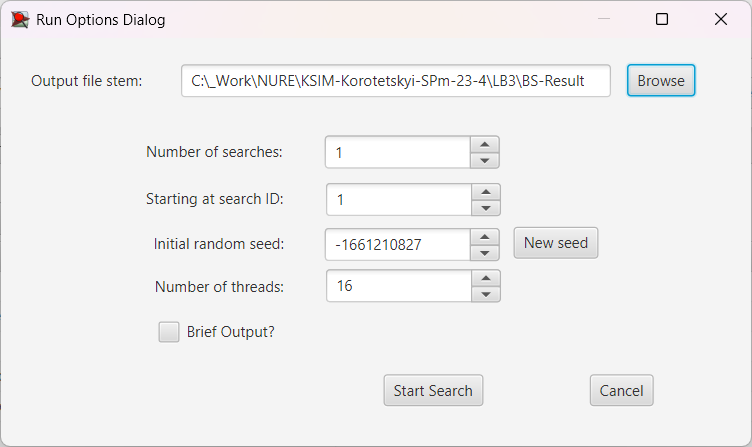

## Комп'ютерні системи імітаційного моделювання
## СПм-23-4, **Коротецький Олександр Олексійович**
### Лабораторна робота №**3**. Використання засобів обчислювального интелекту для оптимізації імітаційних моделей

 

### Варіант 13, модель у середовищі NetLogo:
[Fruit Wars](http://www.netlogoweb.org/launch#http://www.netlogoweb.org/assets/modelslib/Sample%20Models/Social%20Science/Economics/Fruit%20Wars.nlogo)

 

### Вербальний опис моделі:
Розгляд боротьби за обмежені ресурси у різних групах людської популяції. Кожна людина моделюється агентом, який дотримається ряду спрощених правил: він рухається вперед (йде) та повертається в сторони, йде до поживного куща якщо він в радіусі, коли доходить до куща він або збирає їжу з куща (після чого кущ зникає) та (якщо в малому радіусі куща є дві або більше людини) 1 - кооперується в зборі їжі з іншими людьми що прискорює збір їжі і дає енергію всім учасникам збору, 2 - бореться з іншими людьми за їжу (проактивно та реактивно), 3 - втікає від нападаючої людини. Кущі з'являються з певним темпом появи на полі. Після набору певного значення енергії людина розмножується, "дитина" піддається мутаціям геному через що її характеристики і поведінка змінюються. Людина може померти якщо вона: не може знайти їжу достатньо довгий час; живе занадто довгий час; переможена іншою людою.
Модель показує різноманітні стратегії поведінки розрізнених людей за обмежені (хоч і у більшості випадків з часом поновлювані) ресурси та їх переваги та недоліки.

### Керуючі параметри:
- **initial-fruit-bushes** визначає початкову кількість поживних кущів у середовищі моделювання, тобто, в даній моделі, початкову кількість поживних кущів на замкненому полі.
- **initial-foragers** визначає кількість первісних агентів у середовищі моделювання, тобто, в даній моделі, початкову кількість людей на замкненому полі.
- **ticks-to-flee** визначає час за який людина буде втікати від напавшої на неї людини і за який не буде звертати увагу на збір їжі з кущів.
- **rate-of-mutation** визначає шанс появи мутації у одному з генів.
- **collaboration-bonus** визначає бонус швидкості колабораційного (від двох людей у радіусі) збору їжі з поживних кущів.
- **max-age** визначає максимальну тривалість життя людини.
- **bush-growth-chance** визначає шанс появи куща за одиницю часу.

### Внутрішні параметри:
- **energy** метаболічна енергія людини.
- **genome** список генів людини що визначають інтелект, силу та швидкість. Наслідуються "дитиною".
- **foraging?** статус людини чи вона зараз зайнята збором їжі з поживного куща.
- **fleeing?** статус людини чи вона зараз зайнята втечою від нападу іншої людини.
- **fleeing-turns** залишок часу, за спливом якого людина перестане втікати від нападу іншої людини. Це загальний параметр для всіх агентів.
- **age** вік агенту що рахується у проміжках часу.
- **speed** швидкість агенту (переміщення людини пішки). Визначається геномом.
- **strength** сила агенту, визначає успіх боротьби (Борітеся - поборете!). Визначається геномом.
- **intelligence** розум агенту, додатково визначає швидкість колабораційного збору їжі. Визначається геномом.
- **reactive-aggression** визначає шанс спроби нападу на іншу людину (при близості до поживного кущу і наявності там іншої людини). Визначається геномом.
- **proactive-aggression** визначає шанс спроби самозахисту (втечею або боротьбою). Визначається геномом.

### Показники роботи моделі:
- поточна чисельність популяції людей.
- середня чисельність популяції людей за увесь час.
- темп збору їжі, тобто, сумарний показник швидкості збору їжі популяцією.
- кількість смертей розділених за причинами смерті, тобто, графік загальної кількостей смертей за типом (голод, вік, вбивство) від часу.
- кількість випадків боротьби, тобто графік кількості загальних випадків боротьби за типом (реактивний, проактивний) від часу.
- поточна кількість випадків боротьби за короткий проміжок часу за типом
- середнє значення рис популяції, тобто, графік середнього значення характеристик за типом (сила, швидкість, інтелект) наявні в популяції від часу.

 

### Налаштування середовища BehaviorSearch:

**Обрана модель**:
<pre>
C:\_Work\NURE\KSIM-Korotetskyi-SPm-23-4\LB3\FruitWars.nlogo
</pre>
**Параметри моделі** (вкладка Model):
*Параметри та їх модливі діапазони були **автоматично** вилучені середовищем BehaviorSearch із вибраної імітаційної моделі, для цього є кнопка «Завантажити діапазони параметрів із інтерфейсу моделі»*:
<pre>
["initial-fruit-bushes" [0 1 40]]
["initial-foragers" [1 1 100]]
["bush-growth-chance" [0 1 100]]
["ticks-to-flee" [0 1 100]]
["max-age" [1 1 500]]
["collaboration-bonus" [0.1 "C" 5]]
["rate-of-mutation" [0 0.1 10]]
</pre>

**Налаштування цільової функції** (вкладка Search Objective):
Метою підбору параметрів імітаційної моделі, є виявлення параметрів для максимізації швидкості популяції.

**Налаштування алгоритму пошуку** (вкладка Search Algorithm):

Загальний вид вкладки налаштувань алгоритму пошуку:

 

### Результати використання BehaviorSearch:
Діалогове вікно запуску пошуку *(можна залишити за замовчуванням, але стежте, куди пишеться результат)*:

Результат пошуку параметрів імітаційної моделі, використовуючи **генетичний алгоритм**:

Результат пошуку параметрів імітаційної моделі, використовуючи **випадковий пошук**:
